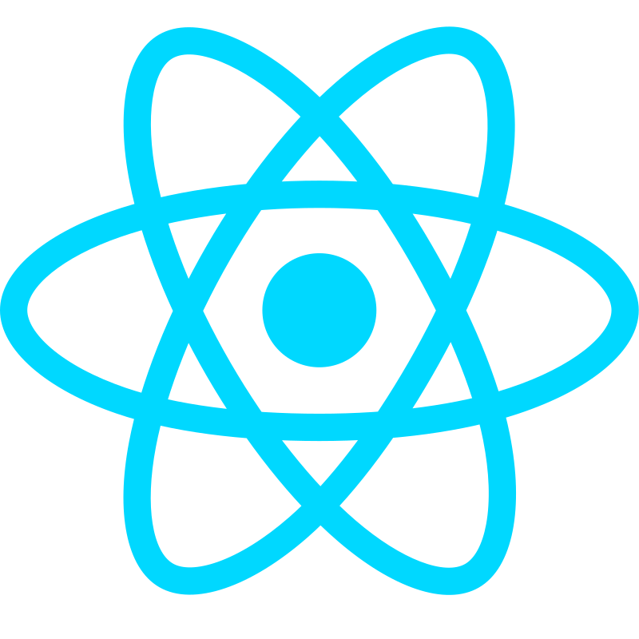
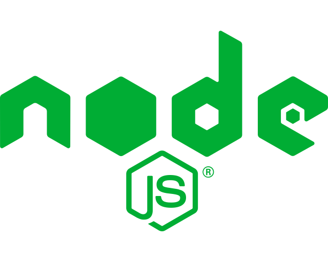
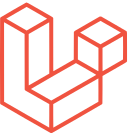

<h1 align="center">Olá, eu sou Andrey 👋</h1>

Desenvolvedor Full Stack Júnior apaixonado por entender como a tecnologia funciona por trás dos bastidores.

<!--   <strong>Technologies</strong> -->

<code></code>
<code></code>
<code></code>
<code></code>
<code></code>
<code></code>
<!-- <code></code> -->
<code></code>
<code></code>
<code></code>
<code></code>

 

 
